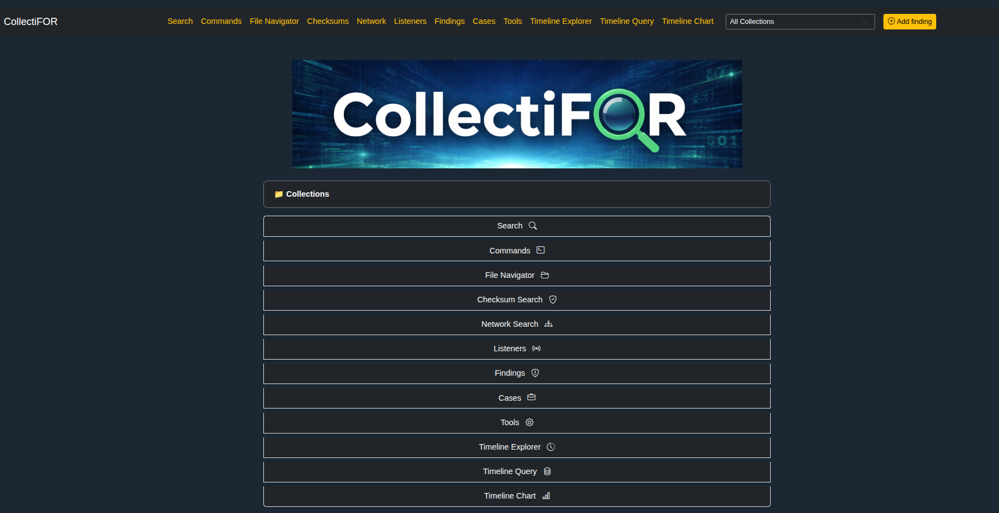

# CollectiFOR | DFIR Triage Tool

CollectiFOR is a digital forensics and incident response (DFIR) triage tool to collect and analyze system and network artifacts from Linux based target machines.
Supports file collection, disk acquisition, memory acquisition, network capture, checksum calculation, and analysis of indicators of compromise. 

This repository is splitted in two main sections:

**collect/**:
  
* The main collect binary
* Other tools to support the data acquisition process.
  
See [collect/README.md](https://github.com/mtask/CollectiFOR/tree/main/collect/README.md)  
(Remote collection: see [ansible-collect](https://github.com/mtask/CollectiFOR/tree/main/ansible_collect))
  
**analyze/**
  
* collectifor.py -\>  Data ingestion (collections collected with `collect` tools and JSONL timeline ingestion), analysis tools (YARA, patterns, etc.), and web based viewer component (collection navigation, search, timeline explorer, etc.)
* helpers/ -\> Plaso, zeek, etc. docker container launch scripts, additional collectien analaysis, etc.
* playbooks/ -\> Playbooks to use the toolset. These are not directly investigation playbooks, but can help with investigation.
  
See [analyze/README.md](https://github.com/mtask/CollectiFOR/tree/main/analyze/README.md)

## Quick how-to

1. Modify collect/config.yaml.sample to match your data collection needs.
2. Copy `collect` binary and config file to target machine(s).
3. Run collection on the target machine:

```bash
sudo ./collect -c ./config.yaml --collect --capture -if eth0
```

4. Move collection directory or tar.gz file to analysis machine
5. Run collectiFOR


```bash
# Might require sudo/root depending on your collection's path and its contents permissions
cd analyze/
python3 -m venv venv
source venv/bin/activate
pip3 install -r requirements.txt
python3 collectifor.py --init --analysis --yara yara/ --pattern patterns/ --viewer --collection /collections/host_20251217_141749.tar.gz 
```

6. Open 127.0.0.1:5000 in your browser and view collection and analysis data



More screenshots of the viewer can be found [here](https://github.com/mtask/CollectiFOR/blob/main/analyze/README.md).

---

## Requirements

- Collection: `collect/requirements.txt` (not relevant when using released binary)
- Analysis/Viewer: `analyze/requirements.txt`
- Optional (for memory acquisition):
  - LiME kernel module
