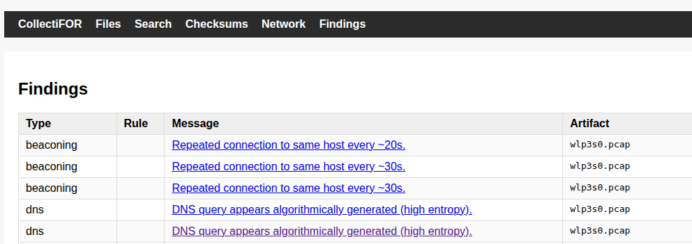
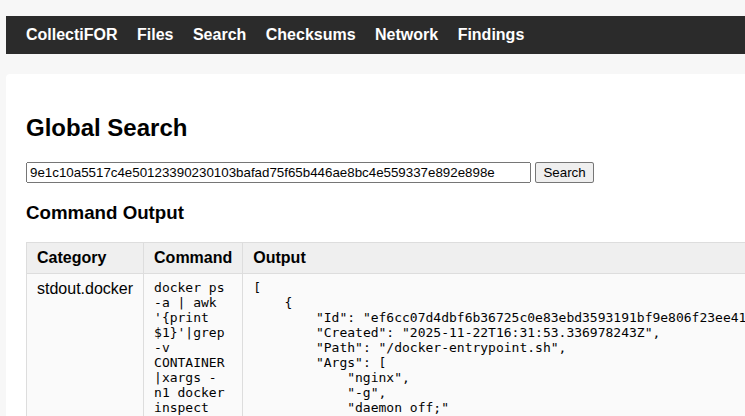
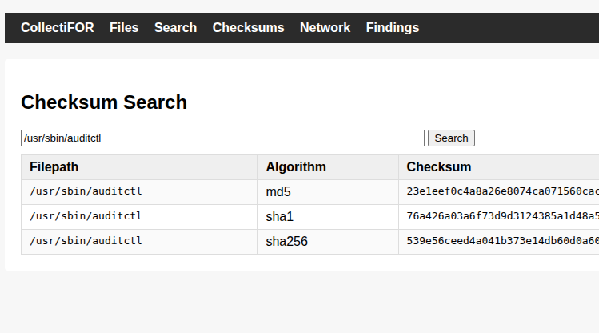

# Usage

```
usage: collectifor.py [-h] [-d DB] [-v] [-y RULE_DIR] [-p PATTERN_DIR] [-l] [-fp] [-pe] [-pc] [--init] [--analysis] [--viewer] collection

Parse forensic collection and store results in SQLite DB

positional arguments:
  collection            Path to collection directory or .tar.gz archive

options:
  -h, --help            show this help message and exit
  -d DB, --db DB        SQLite database file (default: collectifor.db)
  -v, --verbose         Enable verbose logging
  -y RULE_DIR, --yara RULE_DIR
                        Enable yara analysis module by providing path to your yara rules top-level directory.
  -p PATTERN_DIR, --pattern PATTERN_DIR
                        Enable pattern analysis module by providing path your pattern files top-level directory.
  -l, --logs            Enable logs analysis module
  -fp, --file-permissions
                        Enable file permissions analysis module
  -pe, --persistence    Enable persistence analysis module
  -pc, --pcap           Enable PCAP analysis module
  --init                Initialize collection (Run only once against same collection)
  --analysis            Enable and run all analysis modules. Yara module requires --yara RULE_DIR and pattern module --pattern PATTERN_DIR
  --viewer              Launch local analysis viewer
```

## Launch initialization, analysis and viewer

All the analysis and viewing related functionalities are launched with the `collectifor.py` script. Here's all-in-one example command to run everything with a fresh collection tar.gz.

```bash
# Might require sudo/root depending on your collection's permissions
python3 collectifor.py --init --analysis --yara yara/ --pattern patterns/ --viewer /collections/host_20251217_141749.tar.gz 
```

**Arguments**:

* `--init`: -> Initialize collection SQLite database. Default path is `./collectifor.db`
* `--analysis` -> Run analysis modules
* `--yara yara/` -> YARA rules directory for the analysis
* `--pattern patterns/` -> Pattern files directory for the analysis
* `--viewer` -> Launch collectiFOR viewer after initialization and analysis (Listens -> 127.0.0.1:5000)
* `/collections/host_20251217_141749.tar.gz` -> Path to collection. Can be collection tar.gz or collection directory if already decompressed.


To initialize without:

* YARA rules -> remove `--yara DIR` from the command.
* Pattern match -> remove `--pattern DIR` from the command.
* any analysis -> remove `--yara DIR`, `--pattern DIR` and `--analysis` from the command.
* launching the viewer --> remove `--viewere`

**NOTE:** Running initialization twice or more times against the same database will mean duplicate data.


## Viewer

CollectiFOR viewer is Flask based application that provides some simple visibility to collected data and analysis results. 
Like shown in the all-in-one example you can launch viewer as part of the database initialization and/or analysis. With ready database you can just re-run viewer like this:

```
python3 collectifor.py --viewer /collections/host_20251217_141749.tar.gz 
```

Remember to specify `--db <db file>` if you had non-default database path during the initialization.

Here's a list of viewer's functionalities:

* Network data search against ingested data from collection's PCAP file.


* Findings. Results from `--analysis`/`--yara` /`--pattern`.



* String search against the ingested data.



* Checksum data search. Can be search by checksum or by string.



* Simple file navigator based on collection's `files_and_dirs`. Allows to view files as well. This is main usage of the actual collection data in viewer in addition to initialized database.


* View and search for command outputs


* Details about network listening processes


# Collection-Parser-Database mapping

Below table shows which data is currently ingested to CollectiFOR database in initialization.


| Collection           | Parser             | DB table         |
|----------------------|--------------------|------------------|
| commands/            | CommandsParser     | command_output   |
| checksums/           | ChecksumParser     | checksums        |
| files_and_dirs/      | FilesAndDirsParser | files_and_dirs   |
| capture/*.pcap       | PcapParser         | pcap_packets     |
| capture/*.pcap       | PcapParser         | network_flows    |
| file_permissions.txt | PermissionsParser  | file_permissions |
| listeners.json       | ListenersParser    | listeners        |

All parsers skip ingestion gracefully if the related collection data is not found because not all collections include content from every module.

# Analysis modules

Using `--analysis` option with `collectifor.py` enables all analysis modules. YARA and pattern modules do, however, require additional arugments (`--yara` / `--pattern` DIR). 
Other modules also have their own cli options to enable only specific modules instead of all.

**NOTE:** Running same analysis module twice or more times against the same database can mean duplicate findings.

In CollectiFOR database all analysis results are stored in "findings" table. Modules marked as `alpha / PoC` in the below listing are mostly in PoC concept state and have very simplistic analysis.
YARA and Pattern modules use existing source content (YARA rules, IoC listings, etc), so those do not have similar own analysis logic and should yield good results with good rule/pattern sources.

You can skipp all the PoC analysis modules like this if you still want to run YARA and/or PATTERN analysis.

```
python3 collectifor.py --init --yara yara/ --pattern patterns/ --viewer /collections/host_20251217_141749.tar.gz 
```

## Module | YARA

* Enable: `--yara RULES_DIR`

RULES_DIR contains YARA rule files with extension `.yar`. Can contain sub-directories, so you can hava structure like:

```
RULES_DIR
  myrules/*.yar
  rule_provider_Z/*.yar
```

## Module | Pattern

* Enable: `--pattern PATTERN_DIR`

Files in PATTERN_DIR are passed to `grep` as pattern file which means that there should be one "greppable" pattern per line in each file.
Can also contain sub-directories.

## Module | File permissions (alpha / PoC)

* Enable: `--file-permissions`

Does some simple analysis against the `file_permissions.txt` content if the collection has one.

## Module | persistence (alpha / PoC)

* Enable: `--persistence`

Does some simple analysis against the `files_and_dirs` content if the collection has one.

## Module | Logs (alpha / PoC)

* Enable: `--logs`

Does some simple analysis against the `files_and_dirs/var/log` file contents if logs are included in the collection.

## Module | PCAP (alpha / PoC)

* Enable: `--pcap`

Does some simple analysis against the PCAP content if the collection has one.

# Other analysis

There's no reason to user other tools with the collection for additional analysis. You can use tools like plaso to do further analysis against the collection. Or Zeek to do further network analysis against the captured PCAP. The repository contains the following helper scripts:
There are some helper scripts included in the repository and some sample commands and queries in this README.

## Grep patterns

CollectiFOR's pattern parser is basically just a wrapper for grep. You can do similar quick pattern matching just by running grep like this.

```bash
grep -r -f patterns/custom/test.txt /collections/host_20251217_141749/20251217_141749/
# OR with all pattern files
find patterns/ -name "*.txt" -exec grep -rf {} /collections/host_20251217_141749/20251217_141749/ \;
```

## Helper scripts

See `helpers/README.md`.

## Query CollectiFOR database

Here is some sample queries to query data directly from CollectiFOR database after initialization.

## Checksums

### Find filepaths matching checksum

```sql
SELECT filepath,checksum FROM checksums WHERE checksum = '99013dfc1af34a64a8ca13c29301ffe2';
```
### Find checksums matching part of the filepath

```sql
SELECT filepath,checksum FROM checksums WHERE filepath LIKE '%bin/%';
```

## Commands

### Get command output

```
SELECT output FROM command_output WHERE commandline = 'docker images';
```

## network

### Top talkers

```sql
SELECT src, COUNT(*) FROM pcap_packets GROUP BY src ORDER BY COUNT(*) DESC;
```

### DNS queries

```sql
SELECT dns_qname, COUNT(*) FROM pcap_packets WHERE protocol='dns' GROUP BY dns_qname;
```

### Flows

```sql
SELECT src, dst, packet_count FROM network_flows ORDER BY packet_count DESC;
```

### ICMP activity

```sql
SELECT icmp_type, COUNT(*) FROM pcap_packets WHERE protocol='icmp' GROUP BY icmp_type;
```

# Database structure

Here is the current CollectiFOR database structure.

## Tables

```
sqlite> .tables
checksums         file_permissions  findings          pcap_packets    
command_output    files_and_dirs    network_flows
```

All analysis results are inserted to findings table. Other tables are used by initialization (`--init`) parsers.

## Table schemas

```sql
sqlite> .schema checksums
CREATE TABLE checksums (
	id INTEGER NOT NULL, 
	filepath TEXT NOT NULL, 
	checksum VARCHAR NOT NULL, 
	algorithm VARCHAR NOT NULL, 
	inserted_at DATETIME, 
	PRIMARY KEY (id)
);
sqlite> .schema file_permissions
CREATE TABLE file_permissions (
	id INTEGER NOT NULL, 
	filepath TEXT NOT NULL, 
	mode VARCHAR NOT NULL, 
	perm_string VARCHAR NOT NULL, 
	owner VARCHAR NOT NULL, 
	"group" VARCHAR NOT NULL, 
	size INTEGER NOT NULL, 
	timestamp DATETIME NOT NULL, 
	inserted_at DATETIME, 
	PRIMARY KEY (id)
);
sqlite> .schema findings
CREATE TABLE findings (
	id INTEGER NOT NULL, 
	type VARCHAR NOT NULL, 
	message VARCHAR NOT NULL, 
	rule VARCHAR, 
	source_file VARCHAR, 
	tags VARCHAR, 
	meta JSON, 
	namespace VARCHAR, 
	artifact VARCHAR, 
	indicator VARCHAR, 
	inserted_at DATETIME, 
	PRIMARY KEY (id)
);
sqlite> .schema pcap_packets
CREATE TABLE pcap_packets (
	id INTEGER NOT NULL, 
	interface VARCHAR NOT NULL, 
	packet_number INTEGER NOT NULL, 
	timestamp DATETIME NOT NULL, 
	protocol VARCHAR NOT NULL, 
	src VARCHAR, 
	src_port INTEGER, 
	dst VARCHAR, 
	dst_port INTEGER, 
	icmp_type INTEGER, 
	icmp_code INTEGER, 
	dns_qname VARCHAR, 
	dns_qtype VARCHAR, 
	raw_content TEXT, 
	inserted_at DATETIME, 
	PRIMARY KEY (id)
);
sqlite> .schema command_output
CREATE TABLE command_output (
	id INTEGER NOT NULL, 
	category VARCHAR NOT NULL, 
	commandline TEXT NOT NULL, 
	output TEXT NOT NULL, 
	inserted_at DATETIME, 
	PRIMARY KEY (id)
);
sqlite> .schema files_and_dirs
CREATE TABLE files_and_dirs (
	id INTEGER NOT NULL, 
	collection_path VARCHAR NOT NULL, 
	path VARCHAR NOT NULL, 
	type VARCHAR NOT NULL, 
	inserted_at DATETIME, 
	PRIMARY KEY (id)
);
sqlite> .schema network_flows
CREATE TABLE network_flows (
	id INTEGER NOT NULL, 
	protocol VARCHAR NOT NULL, 
	src VARCHAR NOT NULL, 
	src_port INTEGER, 
	dst VARCHAR NOT NULL, 
	dst_port INTEGER, 
	first_seen DATETIME NOT NULL, 
	last_seen DATETIME NOT NULL, 
	packet_count INTEGER, 
	inserted_at DATETIME, 
	PRIMARY KEY (id)
);
```
