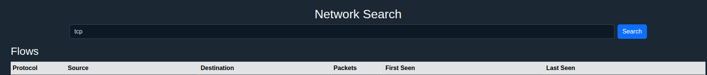
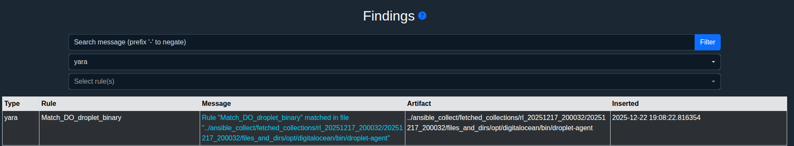
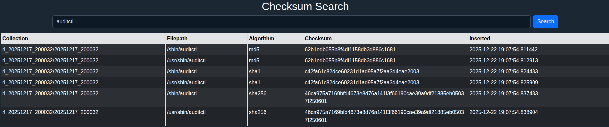
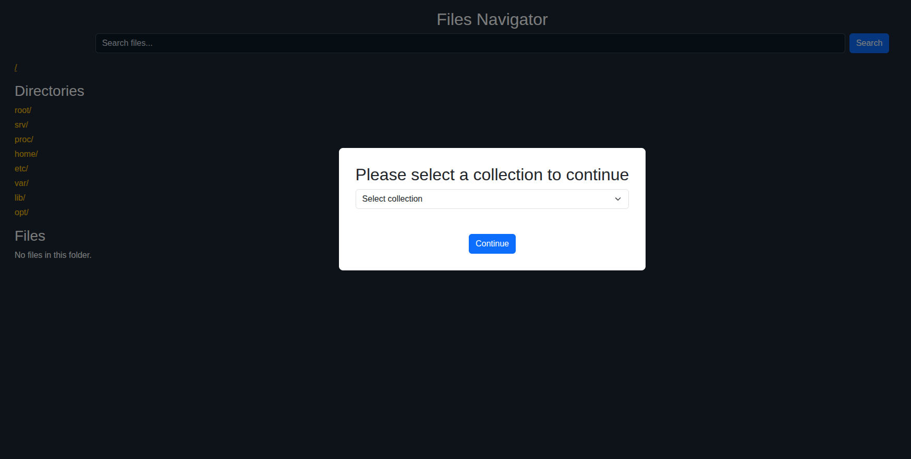
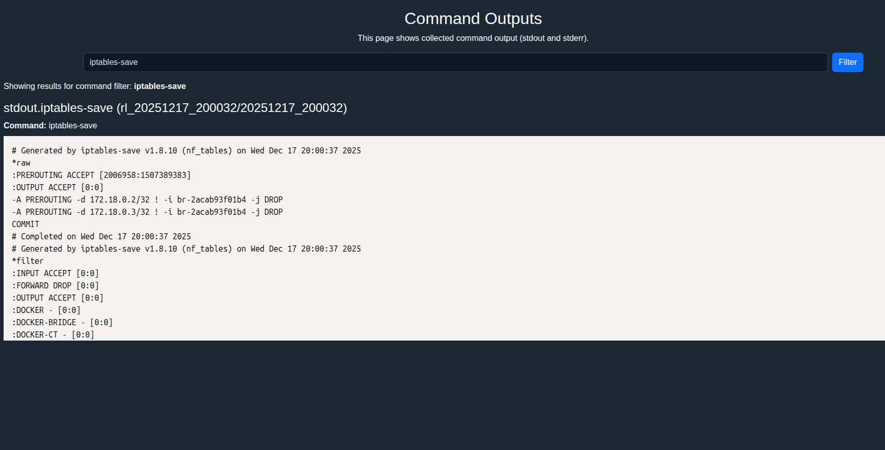

## Viewer

CollectiFOR viewer is Flask based application that provides some simple visibility to collected data and analysis results. 
Like shown in the all-in-one example you can launch viewer as part of the database initialization and/or analysis. With ready database you can just re-run viewer like this:

```
python3 collectifor.py --viewer --collection /collections/host_20251217_141749.tar.gz 
```

Remember to specify `--db <db file>` if you had non-default database path during the initialization.

Here's a list of viewer's functionalities:

<details>
<summary>Network</summary>
* Network data search against ingested data from collection's PCAP file.



</details>

<details>
<summary>Findings</summary>
  
* Findings. Results from `--analysis`/`--yara` /`--pattern`.



</details>

<details>
<summary>Free search</summary>
  
* String search against the ingested data.


</details>

<details>
<summary>Checksum search</summary>
  
* Checksum data search. Can be search by checksum or by string.



</details>

<details>
<summary>File Navigator</summary>
  
* Simple file navigator based on collection's `files_and_dirs`. Allows to view files as well. This is main usage of the actual collection data in viewer in addition to initialized database.



</details>

<details>
<summary>Commands</summary>
  
* View and search for command outputs



</details>

<details>
<summary>Network Listening Processes</summary>
  
* Details about network listening processes


</details>

<details>
<summary>Timeline Explorer</summary>
  
* Explore data from imported JSON lines timeline file.


* Open full details of an event


</details>


<details>
<summary>Timeline Chart</summary>
  
View timeline data in chart (counts, no event details).


</details>
