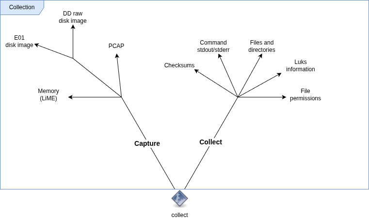

# CollectiFOR | collect

CollectiFOR's `collect` tool is used to collect and capture data from a target host.



## Building

Check [releases](https://github.com/mtask/CollectiFOR/releases) for prebuilt `collect` binary.

* Simple PyInstaller example:

```bash
pip3 install pyinstaller
pyinstaller --onefile --paths=. collect.py
```

* Alternatively use `build.sh` script that provides better support for different Linux distributions. It uses https://github.com/pypa/manylinux and requires docker.

After building ship `./dist/collect` and `config.yaml` to target machine and run collection.

## Usage

1. Download `collect` binary.
2. Configure `config.yaml.sample` to match your needs.
3. Run `collect` with the required options based on your configuration.
4. Copy collection directory or tar.gz (output format depends on configuration)

**Options:**

```
usage: collect [-h] -c CONFIG [--collect] [--capture] [-if INTERFACES] [-dh DISK_HOST] [-d DISK]

CollectiFOR | quick triage collection

options:
  -h, --help            show this help message and exit
  -c CONFIG, --config CONFIG
                        Path to the YAML configuration file
  --collect             Enable collect module
  --capture             Enable capture module
  -if INTERFACES, --interfaces INTERFACES
                        Interfaces for capture module. Multiple interfaces can be seperated with comma
  -dh DISK_HOST, --disk-host DISK_HOST
                        Target host for disk capture. <str>@<str> assumes live capture over ssh. "localhost", "127.0.0.1", or "" assumes local disk.
  -d DISK, --disk DISK  Disk to capture. E.g. /dev/sda
```

**Example:**


```bash
sudo ./collect -c config.yaml.sample --collect --capture -if eth0,eth1
```

Check the collection output path from the last log message. For example:

```
2025-12-07 22:04:07,548 [INFO] Collection finished: /tmp/out/hostname_20251207_220252.tar.gz
```

If `compress_collection` is set to `false` in config.yaml then the collection's result path is directory instead of tar.gz file.

Copy collection to analysis machine and continue with [analysis](https://github.com/mtask/CollectiFOR/tree/main/analyze).

**Example Output Directory Structure:**

```
/tmp/out/<timestamp>/
├── capture/
│   ├── eth0.pcap
│   └── eth0.pcap.txt
├── checksums/
│   ├── md5.txt
│   ├── sha1.txt
│   └── sha256.txt
├── commands/
│   ├── stdout.ps.txt
│   └── stdout.ls.txt
├── file_permissions.txt
└── files_and_dirs/
```

Before actual usage you need to configure the configuration file.

## Modules

Check `config.yaml.sample` for full example. There are two main module structures, collect and capture. In the configuration file those appear like this:

```
modules:
  capture:
  collect:
```

Under those each module is enabled or disabled with keys like `enable_<module_name>`. For example: `enable_commands: true` which would enable collect module `commands`. In the configuration file this would appear like this:

```
modules:
  ...
  collect:
    enable_commands: true
```

In addition to this all modules might have additional configurations under keys `(collect|capture).<module name>.<configuration>`.


<details>

<summary>#Collect module: commands</summary>


Commands module collects outputs (stdout/stderr) for the commands specified in the configuration file.

```
modules:
  ...
  collect:
    enable_commands: true
    commands:
      list:
      - ps auxwwwef
      - aa-status
```

Set commands to execute under the `list` key. In collection the outputs are stored under `commands` directory like this:

```
commands/
total 1288
-rw-r----- 1 root root   3848 Dec 15 13:57 stdout.apt-cache.txt
-rw-r----- 1 root root  18263 Dec 15 13:57 stdout.auditctl.txt
-rw-r----- 1 root root    860 Dec 15 13:57 stdout.aureport.txt
```

Stdout of the executed command is stored under `stdout.<command>.txt` and stderr under `stderr.<command>.txt`. If the same command is executed with different options all of those outputs are stored in the same file.
Each command is seperated with line `#command: <full command>`. Here's an example from `stdout.docker.txt`:

```
#command:docker ps -a
CONTAINER ID   IMAGE                             COMMAND                  CREATED        STATUS                      PORTS     NAMES
...
#command:docker ps -a | awk '{print $1}'|grep -v CONTAINER |xargs -n1 docker inspect
[
    {
        "Id": "ef6cc07
...
```

</details>

<details>

<summary>#Collect module: luks</summary>

The luks module is basically a helper module to run `cryptsetup luksDump <luks device>`. It identifies which devices are potential luks devices before running `cryptsetup`. It stored the output according to the logic of the commands module.

```
$ cat commands/stdout.cryptsetup.txt
#command:cryptsetup luksDump /dev/nvme0n1p3
LUKS header information
Version:       	2
...
```
</details>

<details>

<summary>#Collect module: checksums</summary>


Checksums module collects checksums for the file paths specified in the configuration file.

```
modules:
  ...
  collect:
    enable_checksums: true
    checksums:
      list:
      - /etc/
      - /path/to/some/file.txt

```

Directories are always recursive. Md5, sha1, and sha256 outputs are stored in seperate text files inside the collection:

```
# ls  checksums/
md5.txt  sha1.txt  sha256.txt
```

</details>

<details>

<summary>#Collect module: files_and_dirs</summary>

Files\_and\_dirs module collects copies of file structures for the file paths specified in the configuration file.

```
modules:
  ...
  collect:
    enable_files_and_dirs: true
    files_and_dirs:
      list:
      - /etc/
```

The original directory tree is stored. Directories are always recursive.
Meaning that when, for example, `/etc/passwd` is copied by specifying it directly or just `/etc/` it will appear like this inside the collection:

```
files_and_dirs/etc/passwd
```

</details>

<details>

<summary>#Collect module: listeners</summary>

Listeners module collects information about network listening processes. Data gathered by other modules can be used to collect all the same information, but this quickly collects the data inside a single file. 
Collected details are stored in file `listeners.json` inside the collection.

```
cat listeners.json 
{
  "tcp": [
    {
      "pid": 1239,
      "protocol": "tcp",
      "port": 53,
      "process": "systemd-resolve",
      "exec": "/usr/lib/systemd/systemd-resolved",
      "systemd": "/usr/lib/systemd/system/systemd-resolved.service",
      "related_paths": [
        "/usr/lib/systemd/systemd-resolved"
      ]
```
</details>

<details>

<summary>#Collect module: file_permissions</summary>

File\_permissions module collects file permissions of the file paths specified in the configuration file.

```
modules:
  ...
  collect:
    enable_file_permissions: true
    file_permissions:
      list:
      - /etc/
```

Directories are always recursive. Results are stored in file `file_permissions.txt ` inside the collection.

```
head -n 1 file_permissions.txt 
/etc/gshadow- 640 -rw-r----- root:shadow 1172 1764100568.0
```
</details>

<details>

<summary># Capture module: disk</summary>

Capture disk image from a locally attached disk (DD/E01) or remotely via SSH (DD).

```yaml
  capture:
    enable_disk: true
    capture_method: dd|e01
    disk:
  ...
```


* **SSH:**

Only capture method "dd" supported.

```
./dist/collect -c config.yaml --capture -d "/dev/vda" -dh "user@ip"
```

Note that with remote ssh usage the module requires ssh key authentication, root login or passwordless sudo, and it skips host key verification.

* **Local:**

Capture methods "dd" or "e01" are supported.

```
./dist/collect -c config.yaml --capture -d "/dev/sda" -dh "localhost"
```

Module requires `pv` on the local system and `dd` on remote system when capture method is "dd". With "e01" `ewfacquire` is required. 
</details>

<details>

<summary># Capture module: network</summary>

Capture network traffic for the given time perioid. Uses scapy module for the capture and capture interfaces are specified with command line argument `-if / --interfaces <if1,if2,if3>`.

```yaml
  capture:
    enable_network: true
    # seconds
    network:
      timeout: 60
  ...
```

Pcap and extracted text file version are stored under "capture" directory inside the collection. Simple text extraction is mainly done due to quicker pattern based analysis e.g. against IP-based IoCs.

```
ls capture/eth0.pcap*
capture/eth0.pcap  capture/eth0.pcap.txt
```
</details>

<details>

<summary># Capture module: memory</summary>

Example to enable memory capture and use lime module found in path `memory/lime-6.14.0-36-generic.ko`

```yaml
  capture:
  ...
    enable_memory: true
    memory:
      capture_method: lime
      lime:
        # Module not included
        path: memory/lime-6.14.0-36-generic.ko
        # Format: lime/raw
        format: lime
```

Memory capture is stored under "capture" directory inside the collection.
</details>

## Running modules in own threads

You can run any module in its own thread by specifying `own_thread` to `true` inside the module's config. Here's an example with the network module: 

```
modules:
  capture:
    # Capture network traffic
    enable_network: true
    # seconds
    network:
      own_thread: true
```

The `own_thread` parameter defaults to `false` with all modules if not specified. Note that early KeyboardInterrupt is captured and threads are waited to finish.
With early KeyboardInterrupt incompleted collection is removed after all threaded jobs are finished.
