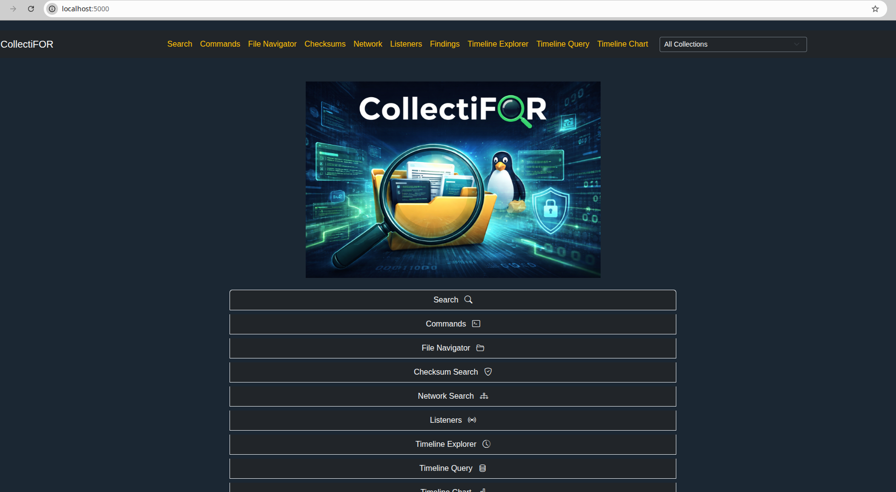
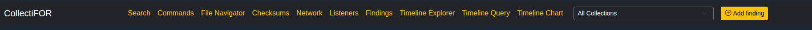
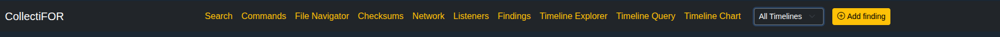
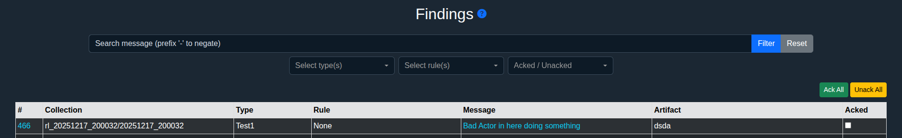
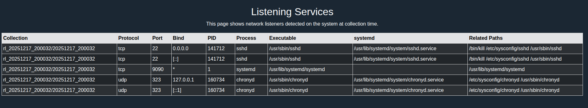
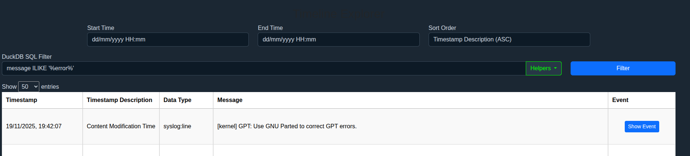
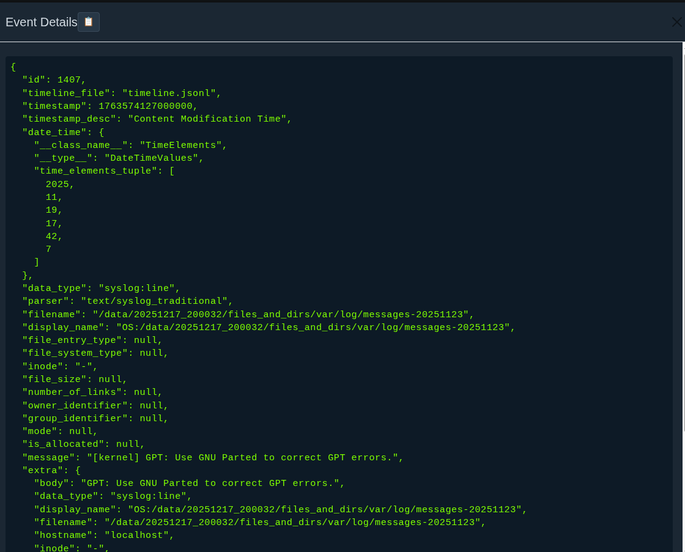
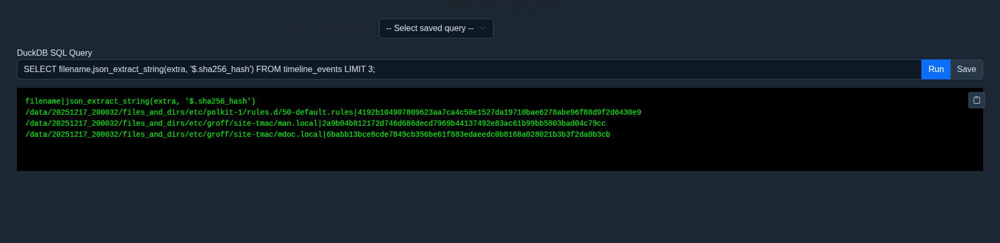
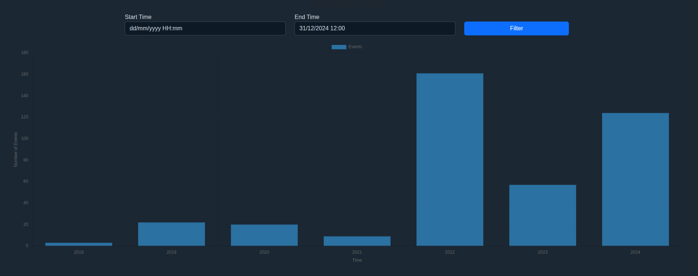

## Viewer

CollectiFOR Viewer is Flask based application that provides some simple visibility to collected data, analysis results and timeline files. 



With ready database you can run the viewer just like this:

```
python3 collectifor.py -c config.yaml.sample --viewer
```
You can also launch viewer at the same time with `--init`, `--analysis`, and/or `--timeline-file` options.
Ensure you are using configuration file which database path(s) match the wanted collection and/or timeline databases.
> [!WARNING]
> Viewer is intended to be hosted as local web application and it's binded by default to `localhost:5000`. 
> It's not safe to expose it to a network as there's login and functionalities are intended for local use only.
> App does not follow common web security practices by design in functionalities like direct SQL query access.

  
**Functionalities:**

By default all collections and timelines are used when the viewer is launched. File Navigator can only work with one collection at the time and enforces to select a collection.
There's a dropdown menu at the right side of the navigation bar were you can select a specific collection/timeline or all collections/timelines depending on the current page.




Some collection related search features support simple query language like this:

1. **Free-text search:**  
   Type one or more words to filter messages containing all words.  
   Example: `ssh sudo` → messages containing both 'ssh' **AND** 'sudo'.

2. **Negation:**  
   Prefix a word with `-` to exclude messages containing it.  
   Example: `ssh -root` → messages containing 'ssh' but **NOT** 'root'.

3. **OR operator:**  
   Use `|` to match any of multiple terms within a group.  
   Example: `user|admin` → messages containing 'user' **OR** 'admin'.  
   Combine with spaces for AND logic: `user|admin ssh` → ('user' **OR** 'admin') **AND** 'ssh'.

4. **Multi-term filtering:**  
   Combine multiple include and exclude terms.  
   Example: `ssh sudo -root -admin` → messages containing 'ssh' **AND** 'sudo' **AND NOT** containing 'root' **OR** 'admin'.

5. **Quotes:**  
   Include as one string → `"include this text"`.  
   Exclude as one string → `-"exclude this text"`.

There's a question mark icon that shows a similar help-text to indicate that the page's search functionality supports these type of queries.

<details>
<summary>Collection search</summary>
  
* String search against the ingested data. Supports a simple query language. See its instructions by pressing the question mark icon on the page.


</details>

<details>
<summary>Findings</summary>
  
* Findings from analysis. Supports a simple query language. See its instructions by pressing the question mark icon on the page.




</details>

<details>
<summary>Network</summary>

* Network data search against ingested data from collection's PCAP file.


</details>


<details>

<summary>Checksum search</summary>
  
* Checksum data search. Can be searched by checksum or by string.


</details>

<details>
<summary>File Navigator</summary>
  
* Simple file navigator based on collection's `files_and_dirs`. Enforces to select a specific collection for navigation.

Viewing actual file content requires that extracted collection directory is found on the same path that it was during the database initialization. 


</details>

<details>
<summary>Commands</summary>
  
* View and search for command outputs. Search allows to search by command (e.g. docker, ps, iptables, etc.). You can also search only for stdout or stderr content with prefix `(stdeout|stderr).<command>`.


</details>

<details>
<summary>Network Listening Processes</summary>
  
* Details about network listening processes



</details>

<details>
<summary>Timeline Explorer</summary>
  
* Explore data from imported JSON line formatted timeline files. 

Supports event filtering via direct SQL query syntax. For example: `<field> ILIKE '%string%'. UI has some helper queries. Timeline database is DuckDB so adjust your filters according to that.



* Open full details of an event



</details>

<details>
<summary>Timeline Query</summary>
  
* Full SQL query interface to timeline database. Allows saving queries and copying output to clipboard.



</details>

<details>
<summary>Timeline Chart</summary>
  
View timeline data in chart (counts, no event details).

</details>
